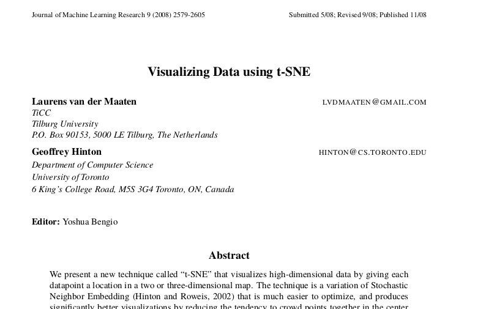

```{r setup, include=FALSE}
fig.dim <- 4
knitr::opts_chunk$set(fig.width=2*fig.dim,
                      fig.height=fig.dim,
                      fig.align='center')
set.seed(23)
library(tidyverse)
library(rstan)
library(matrixStats)
rstan_options(auto_write = TRUE)
options(mc.cores = parallel::detectCores())
```

# t-SNE



[t-SNE](https://en.wikipedia.org/wiki/T-distributed_stochastic_neighbor_embedding) is a recently population dimension reduction method.

It [makes very nice visualizations](https://distill.pub/2016/misread-tsne/).


# Simulate data

Let's first make some data.
This will be some points distributed around a ellipse in $n$ dimensions.

```{r sim_data, cache=TRUE}
n <- 20
npts <- 1e3
xy <- matrix(rnorm(n*npts), ncol=n)
theta <- runif(npts) * 2 * pi
ab <- matrix(rnorm(2*n), nrow=2)
ab[,2] <- ab[,2] - ab[,1] * sum(ab[,1] * ab[,2]) / sqrt(sum(ab[,1]^2))
ab <- sweep(ab, 1, sqrt(rowSums(ab^2)), "/")
for (k in 1:npts) {
    dxy <- 4 * c(cos(theta[k]), sin(theta[k])) %*% ab
    xy[k,] <- xy[k,] + dxy
}
```

Here's what the data look like:
```{r plot_data, fig.width=6*fig.dim, fig.height=6*fig.dim}
pairs(xy, pch=20)
```

But there is hidden, two-dimensional structure:
```{r plot_ring, fig.height=2*fig.dim}
plot(xy %*% t(ab), xlab='dimension 1', ylab='dimension 2', 
     pch=20, col=rainbow(nrow(xy))[rank(theta)])
```

Now let's build the distance matrix.

```{r dist_mat}
dmat <- as.matrix(dist(xy)) 
```

# Implementation

The quantity to be minimized is Kullback-Leibler distance between $p$ and $q$,
defined as
$$\begin{aligned}
    \text{KL}(p|q) 
        &= \sum_x p_x \log(p_x/q_x) .
\end{aligned}$$

Here is a Stan block.
```{r stan_tsne, cache=TRUE}
tsne_block <- '
data {
    int N; // number of points
    int n; // input dimension
    int k; // output dimension
    matrix[N,N] dsq;  // distance matrix, squared
}
parameters {
    real<lower=0> sigma_sq; // in kernel for p 
    matrix[N,k] y;
}
model {
    matrix[N,N] q;
    real dt;
    matrix[N,N] p;
    q[N,N] = 1.0;
    for (i in 1:(N-1)) {
        q[i,i] = 1.0;
        for (j in (i+1):N) {
            q[i,j] = 1 / (1 + squared_distance(y[i], y[j]));
            q[j,i] = q[i,j];
        }
    }
    for (i in 1:N) {
        q[i] = q[i] / (sum(q[i]) - q[i,i]);
    }
    // create p matrix
    p = exp(-dsq/(2*sigma_sq));
    for (i in 1:N) {
        p[i] = p[i] / (sum(p[i]) - p[i,i]);
    }
    // compute the target
    for (i in 1:N) {
        dt = (-1) * sum(p[i] .* log(p[i] ./ q[i]));
        target += dt;
    }
    sigma_sq ~ normal(0, 10);
}'


tk <- 2
tsne_model <- stan_model(model_code=tsne_block)
```

```{r run_tsne, cache=TRUE, dependson=c("stan_tsne", "sim_data")}
runtime <- system.time(tsne_optim <- optimizing(tsne_model,
                                 data=list(N=nrow(xy),
                                           n=ncol(xy),
                                           k=tk,
                                           dsq=(dmat/max(dmat))^2)))
runtime
```

## It works!

```{r plot_tsne, fig.width=4*fig.dim, fig.height=2*fig.dim}
out_y <- do.call(cbind, lapply(1:tk, function (k) {
                                   tsne_optim$par[sprintf("y[%d,%d]", 1:nrow(xy), k)]
                           } ) )
layout(t(1:2))
plot(out_y, xlab='t-sne 1', ylab='t-sne 2', main="t-SNE",
     pch=20, col=rainbow(nrow(xy))[rank(theta)])
plot(xy %*% t(ab), xlab='input 1', ylab='input 2', main="'truth'",
     pch=20, col=rainbow(nrow(xy))[rank(theta)])

```


# Another case

This time let's apply the method to a high-dimensional random walk.

```{r sim_rw, cache=TRUE}
n <- 40
npts <- 1e2
rw <- colCumsums(matrix(rnorm(n*npts), ncol=n))
```

Here's what the data look like:
```{r plot_rw, fig.width=6*fig.dim, fig.height=6*fig.dim}
pairs(rw, col=adjustcolor(rainbow(npts), 0.5), pch=20)
```

Now let's build the distance matrix.

```{r dist_mat_rw}
rw_dmat <- as.matrix(dist(rw)) 
```

```{r run_tsne_rw, cache=TRUE, dependson=c("stan_tsne", "sim_rw")}
rw_runtime <- system.time(rw_tsne_optim <- optimizing(tsne_model,
                                 data=list(N=nrow(rw),
                                           n=ncol(rw),
                                           k=tk,
                                           dsq=(rw_dmat/max(rw_dmat))^2)))
rw_runtime
```

## It works!

```{r plot_rw_tsne, fig.width=2*fig.dim, fig.height=2*fig.dim}
rw_y <- do.call(cbind, lapply(1:tk, function (k) {
                                   rw_tsne_optim$par[sprintf("y[%d,%d]", 1:nrow(xy), k)]
                           } ) )
plot(rw_y, xlab='t-sne 1', ylab='t-sne 2', main="t-SNE",
     pch=20, col=rainbow(nrow(rw)))

```

