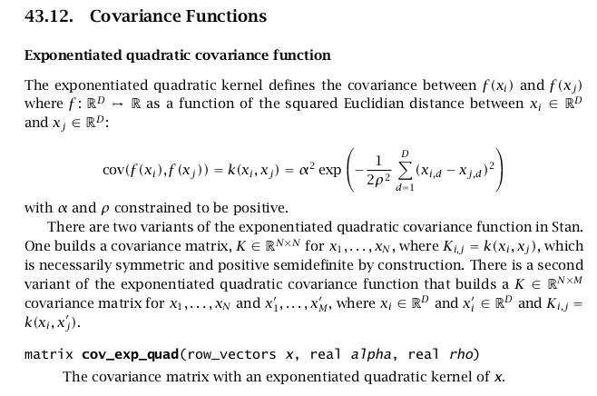

```{r setup, include=FALSE}
fig.dim <- 4
knitr::opts_chunk$set(fig.width=2*fig.dim,
                      fig.height=fig.dim,
                      fig.align='center')
set.seed(23)
library(lars)
library(tidyverse)
library(rstan)
library(matrixStats)
library(MASS)
options(mc.cores = parallel::detectCores())
```

# Spatial models

## A simple scenario

Suppose we have estimates of abundance of a soil microbe
from a number of samples across our study area:

```{r sim_data_plot, echo=FALSE}
library(mvtnorm)
N <- 20
xy <- data.frame(x=runif(N), y=runif(N))
dxy <- as.matrix(dist(xy))
ut <- upper.tri(dxy, diag=TRUE)
truth <- list(rho=.6,
              nugget=.1,
              delta=5,
              mu=5)
truth$covmat <- (truth$nugget * diag(N) 
                 + truth$delta * exp(-(dxy/truth$rho)^2))
xy$z <- as.vector(rmvnorm(1, mean=rep(truth$mu,N), sigma=truth$covmat))
```

```{r show_study, echo=FALSE}
layout(t(1:2))
plot(xy$x, xy$y, xlab='eastings', ylab='northings', pch=21,
     cex=xy$z/4,
     bg=colorRampPalette(c('blue', 'red'))(10)[cut(xy$z, breaks=10)],
     main='size, color = abundance', asp=1)
plot(dxy[ut], abs(xy$z[row(dxy)[ut]] - xy$z[col(dxy)[ut]]),
     pch=20, cex=0.5,
     xlab='distance apart',
     ylab='|difference in abundance|')

```

## The data

`(x,y)` : spatial coords; `z` : abundance

```{r show_data}
xy
```

----------------------

**Goals:** 

1. (descriptive) What spatial scale does abundance vary over?

2. (predictive) What are the likely (range of) abundances at new locations?


# Spatial covariance

## Tobler's First Law of Geography:

> Everything is related to everything else, but near things are more related than distant things.

. . .

*Modeler:* Great, covariance is a decreasing function of distance.


## A decreasing function of distance.

A convenient choice: the covariance between two points distance $d$ apart is
$$\begin{aligned}
    \alpha^2 \exp\left(- \frac{1}{2}\left(\frac{d}{\rho}\right)^2 \right) .
\end{aligned}$$

- $\alpha$ controls the overall variance (amount of noise)

- $\rho$ is the spatial scale that covariance decays over


## In Stan



------------

Here's an `R` function that takes a set of locations (`xy`),
a variance scaling `alpha`, and a spatial scale `rho`:
```{r cov_exp_quad}
cov_exp_quad <- function (xy, alpha, rho) {
    # return the 'quadratic exponential' covariance matrix
    # for spatial positions xy
    dxy <- as.matrix(dist(xy))
    return( alpha^2 * exp( - (1/2) * dxy^2 / rho^2 ) )
}
```

. . .

**Challenge:** simulate spatially autocorrelated random Gaussian values,
and plot them, in space. Pick parameters so you can tell they are autocorrelated.

. . .

*to color points by a continuous value:*
```
     colorRampPalette(c('blue', 'red'))(24)[cut(xy$z, breaks=24)]
```

## Simulation

```{r sim_sp_pts}
library(mvtnorm)
N <- 100
# spatial extent of order 1
xy <- data.frame(y=runif(N),
                 x=rnorm(N))
rho <- .25
alpha <- 1.0
# compute covariance matrix
K <- cov_exp_quad(xy, alpha, rho)
# simulate z's
xy$z <- as.vector(rmvnorm(1, mean=rep(0,N),
                          sigma=K))

```

-------------

```{r plot_pts}
plot(xy$x, xy$y, xlab='x spatial coord', 
     ylab='y spatial coord', pch=20, asp=1,
     cex=as.numeric(cut(xy$z, breaks=10))/2,
     col=colorRampPalette(c('blue', 'red'))(24)[cut(xy$z, breaks=24)])
```

## Simulation number 2

```{r sim_sp_pts2, cache=TRUE}
library(mvtnorm)
N <- 1000
# spatial extent of order 1
xy <- data.frame(x=runif(N),
                 y=rnorm(N))
rho <- .25
alpha <- 1.0
# compute covariance matrix
K <- cov_exp_quad(xy, alpha, rho)
# simulate z's
xy$z <- as.vector(rmvnorm(1, mean=rep(0,N),
                          sigma=K))
```

-------------

```{r plot_pts2, cache=TRUE, dependson="sim_sp_pts2"}
plot(xy$y, xy$x, xlab='y spatial coord', 
     ylab='x spatial coord', pch=20, asp=1,
     cex=as.numeric(cut(xy$z, breaks=10))/2,
     col=colorRampPalette(c('blue', 'red'))(24)[cut(xy$z, breaks=24)])
```

# Back to the data

## Goals


1. (descriptive) What spatial scale does abundance vary over?

    $\Rightarrow$ What is $\rho$?

2. (predictive) What are the likely (range of) abundances at new locations?

    $\Rightarrow$ Add unobserved abundances as *parameters*.


## A basic Stan block

```{r spstan, cache=TRUE}
sp_block <- "
data {
    int N; // number of obs
    vector[2] xy[N]; // spatial pos
    vector[N] z;
}
parameters {
    real<lower=0> alpha;
    real<lower=0> rho;
}
model {
    matrix[N, N] K;
    K = cov_exp_quad(xy, alpha, rho);

    z ~ multi_normal(rep_vector(0.0, N), K);
    alpha ~ normal(0, 5);
    rho ~ normal(0, 5);
}
"
# check this compiles
sp_model <- stan_model(model_code=sp_block)
```


-------------------

**Challenge:** we would like to estimate the abundance
at the `k` locations `new_xy`. Add this feature to the Stan block.

```
```{r show_spstan, echo=FALSE, results='asis'}
cat(sp_block)
```
```


## A solution

```{r new_spstan, cache=TRUE}
sp_block <- "
data {
    int N; // number of obs
    vector[2] old_xy[N]; // spatial pos
    vector[N] old_z;
    int n;
    vector[2] new_xy[n]; // new locs
}
transformed data {
    vector[2] xy[N+n];
    xy[1:N] = old_xy;
    xy[(N+1):(N+n)] = new_xy;
    print(dims(old_z));
}
parameters {
    real<lower=0> alpha;
    real<lower=0> rho;
    vector[n] new_z;
    real<lower=0> delta;
    real mu;
}
model {
    matrix[N+n, N+n] K;
    vector[N+n] z;
    K = cov_exp_quad(xy, alpha, rho);
    for (k in 1:(N+n)) {
        K[k,k] += delta;
    }
    z[1:N] = old_z;
    z[(N+1):(N+n)] = new_z;
    z ~ multi_normal(rep_vector(mu, N+n), K);
    alpha ~ normal(0, 5);
    rho ~ normal(0, 5);
    delta ~ normal(0, 5);
    mu ~ normal(0, 5);
}
"

new_sp <- stan_model(model_code=sp_block)
```

## Simulate data


```{r sim_data, cache=TRUE}
library(mvtnorm)
N <- 20
xy <- data.frame(x=runif(N), y=runif(N))
dxy <- as.matrix(dist(xy))
ut <- upper.tri(dxy, diag=TRUE)
truth <- list(rho=.6,
              delta=.1,
              alpha=2.5,
              mu=5)
truth$covmat <- (truth$delta * diag(N) 
                 + truth$alpha^2 * exp(-(dxy/truth$rho)^2))
xy$z <- as.vector(rmvnorm(1, mean=rep(truth$mu,N), sigma=truth$covmat))
```

## It runs.

```{r run_new_sp, cache=TRUE, dependson=c("new_spstan","sim_data")}
new_xy <- cbind(x=runif(5), y=runif(5))
sp_data <- list(N=nrow(xy),
                old_xy=cbind(xy$x, xy$y),
                old_z=xy$z,
                n=nrow(new_xy),
                new_xy=as.matrix(new_xy))

(sp_time <- system.time(
    sp_fit <- sampling(new_sp,
                       data=sp_data,
                       iter=1000,
                       chains=2,
                       control=list(adapt_delta=0.99,
                                    max_treedepth=12))))
```

## Does it work?

```{r show_sp_results}
cbind(truth=truth[c("alpha", "rho", "delta", "mu")],
      rstan::summary(sp_fit, pars=c("alpha", "rho", "delta", "mu"))$summary)
```

----------------


```{r plot_pts_interp, cache=TRUE, dependson="sim_sp_pts2", echo=FALSE, fig.height=2*fig.dim}
new_z <- extract(sp_fit, pars="new_z")$new_z
plot(c(xy$x,new_xy[,1]), c(xy$y,new_xy[,2]), xlab='x spatial coord', 
     ylab='y spatial coord', pch=20, 
     cex=as.numeric(cut(c(xy$z,colMeans(new_z)), breaks=0:10)),
     col=colorRampPalette(c('blue', 'red'))(11)[cut(c(xy$z,colMeans(new_z)), breaks=0:10)])
points(new_xy[,1], new_xy[,2], cex=8)
legend("topright", pch=1, pt.cex=8,
       legend="interpolated points")
```

## Conclusions


1. (descriptive) What spatial scale does abundance vary over?

    Values are correlated over distances of order $\rho=`r mean(extract(sp_fit,pars="rho")$rho)`$ units of distance.

2. (predictive) What are the likely (range of) abundances at new locations?

    These are
```{r new_z_summary, echo=FALSE}
cbind(new_xy, rstan::summary(sp_fit, pars="new_z")$summary[,c(1,3)])
```


# Network models

## What we've just done

- **Model:** the data are *multivariate Normal*,

- with *nearby* locations have *more correlated* values.

. . .

- To do this, we set the entries of the covariance matrix equal to a decreasing function of *distance*;

- then, we could *estimate* values at unobserved locations.

. . .

We could do the *same thing* in a **network** model,
calculating "nearby" and "distance" with the network.


# Summary

## We can now

1. Simulate autocorrelated values on a landscape.

2. Parameterize and fit a spatial, multivariate Normal model.

3. Interpolate a noisy landscape to unobserved locations.


