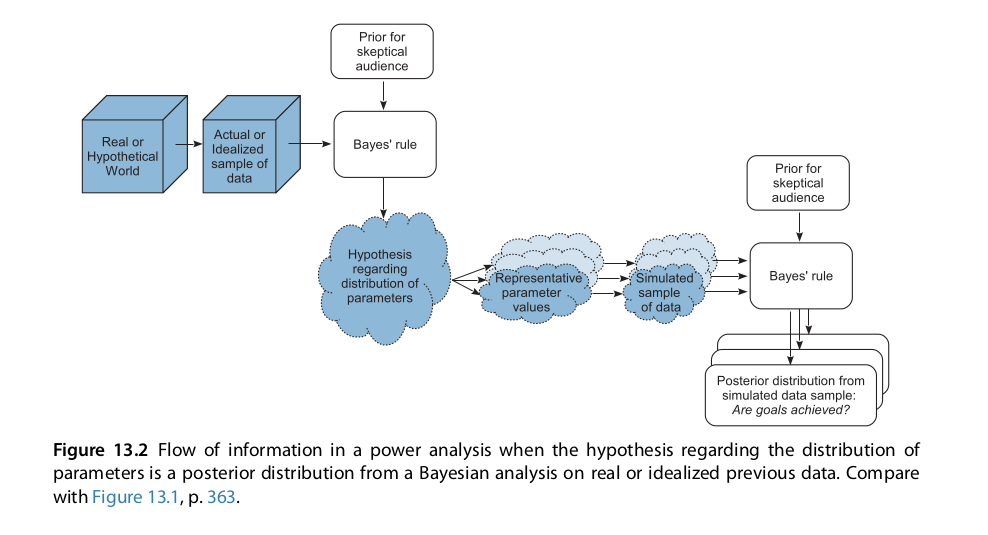

```{r setup, include=FALSE}
fig.dim <- 4
knitr::opts_chunk$set(fig.width=2*fig.dim,
                      fig.height=fig.dim,
                      fig.align='center')
set.seed(23)
library(tidyverse)
library(rstan)
library(matrixStats)
options(mc.cores = parallel::detectCores())
```

## Outline

1. Uses of simulation

2. ... applied to the hierarchical model.

3. Posterior predictive sampling.

4. Shrinkage: sharing information

5. Predicting binary outcomes from quantitative variables: Bayesian logistic regression


# Back to baseball

## From last time:


:::::::::::::: {.columns}
::: {.column width="60%"}

$$\begin{aligned}
    Z_i &\sim \Binom(N_i, \theta_i) \\
    \theta_i &\sim \Beta(\mu_{p_i} \kappa_{p_i}, (1-\mu_{p_i})\kappa_{p_i}) \\
    \mu &\sim \Beta(1, 1) \\
    \kappa_p &\sim \Gam(0.1, 0.1) .
\end{aligned}$$

::::::::::::::
::: {.column width="40%"}


```{r stan_model}
pos_model <- "
data {
    int N;   // number of players
    int hits[N];
    int at_bats[N];
    int npos; // number of positions
    int position[N];
}
parameters {
    real<lower=0, upper=1> theta[N];
    real<lower=0, upper=1> mu[npos];
    real<lower=0> kappa[npos];
}
model {
    real alpha;
    real beta;
    hits ~ binomial(at_bats, theta);
    for (i in 1:N) {
        alpha = mu[position[i]] * kappa[position[i]];
        beta = (1 - mu[position[i]]) * kappa[position[i]];
        theta[i] ~ beta(alpha, beta);
    }
    mu ~ beta(1,1);
    kappa ~ gamma(0.1,0.1);
} "
```


::::::
::::::::::::::


--------------------


```{r fit_pos_model, cache=TRUE}
batting <- read.csv("BattingAverage.csv", header=TRUE)
system.time(pos_fit <- stan(model_code=pos_model, chains=3, iter=100,
                            data=list(N=nrow(batting),
                                      hits=batting$Hits,
                                      at_bats=batting$AtBats,
                                      npos=nlevels(batting$PriPos),
                                      position=as.numeric(batting$PriPos))))
```

## Diagnostics

```{r print_fit}
print(pos_fit, pars=c("mu", "kappa"))
```

----------------

Is it mixing?

```{r plot_trace}
stan_trace(pos_fit, pars="mu")
```


## Run longer!

```{r fit_pos_model_again, cache=TRUE}
system.time(pos_fit <- stan(model_code=pos_model, chains=3, iter=1000,
                            control=list(max_treedepth=15),
                            data=list(N=nrow(batting),
                                      hits=batting$Hits,
                                      at_bats=batting$AtBats,
                                      npos=nlevels(batting$PriPos),
                                      position=as.numeric(batting$PriPos))))
```

-------------

```{r print_fit_again}
print(pos_fit, pars=c("mu", "kappa"))
```


-------------

Is it mixing?

```{r plot_trace_again}
stan_trace(pos_fit, pars="mu")
```

-------------

```{r plot_kappa_again}
stan_trace(pos_fit, pars="kappa")
```

## Let's look at the results!

```{r first_hist}
stan_hist(pos_fit, pars="mu", bins=30) + xlim(0, 0.4)
```

-----------

I like labels.

```{r plot_mu}
param_samples <- extract(pos_fit)
layout(matrix(1:9, ncol=3))
par(mar=c(4,3,1,1)+.1)
for (k in 1:9) {
    hist(param_samples$mu[,k], main=levels(batting$PriPos)[k],
         xlim=c(0, 0.4), xlab='batting average', ylab=expression(mu))
}
```

-----------


```{r plot_kappa}
layout(matrix(1:9, ncol=3))
par(mar=c(4,3,1,1)+.1)
for (k in 1:9) {
    hist(param_samples$kappa[,k], main=levels(batting$PriPos)[k],
         xlab='batting average', ylab=expression(kappa))
}
```

## What else do you want to know?

About
$$\begin{aligned}
    \theta_i &: \text{individual $i$ batting averages} \\
    \mu &: \text{position $p$ mean batting averages} \\
    \kappa_p &: \text{position $p$ variability of batting averages}
\end{aligned}$$


## Do positions with more at-bats have higher batting averages?

To answer this, let's find the posterior distribution
of the difference in means ($\mu_p$) between two positions,
1st base, who have a lot of at-bats, and pitchers, who don't.

To do this, we'll use the random samples obtained with `extract()`.
```{r diff_means}
first_base_col <- which(levels(batting$PriPos) == "1st Base")
pitcher_col <- which(levels(batting$PriPos) == "Pitcher")
mu_diff <- param_samples$mu[,first_base_col] - param_samples$mu[,pitcher_col]
```

The posterior mean of $\mu_\text{1st base} - \mu_\text{pitcher}$ is `r mean(mu_diff)`;
and the posterior SD is `r sd(mu_diff)`.
This is a very large difference,
and we are very certain of this -
our estimate of a 95% credible interval for the difference is from
`r quantile(mu_diff, 0.025)` to `r quantile(mu_diff, 0.975)`.


## What position has the most consistent batting average?

Find the posterior distribution of SDs of $\theta_i$s, separately by position.

```{r pos_sds, echo=-1}
pos_sds <- sapply(1:nlevels(batting$PriPos), function (k) {
                      use_these <- batting$PriPos == levels(batting$PriPos)[k]
                      rowSds(param_samples$theta[,use_these])
         } )
colnames(pos_sds) <- levels(batting$PriPos)
boxplot(pos_sds, las=3)
```


# Stochastic minute

## Exponential, and Gamma

If $T \sim \Exp(\text{rate}=\lambda)$, then

$$\begin{aligned}
   \P\{ T \in dt \} = \lambda e^{-\lambda t} dt .
\end{aligned}$$

1. $T$ can be any nonnegative real number.

2. $T$ is *memoryless*: 
   $$\begin{aligned}
        \P\{ T > x + y \given T > x \} = \P\{ T > y \} .
   \end{aligned}$$

3. A machine produces $n$ widgets per second;
   each widget has probability $\lambda/n$ of being broken.
   The time until the first broken widget appears (in seconds)
   is approximately $\sim \Exp(\lambda)$.

---------------------

If $S \sim \Gam(\text{shape}=\alpha, \text{rate}=\lambda)$, then

$$\begin{aligned}
   \P\{ S \in dt \} = \frac{\alpha^\lambda}{\Gamma(\alpha)} t^{\alpha - 1} e^{-\lambda t} dt .
\end{aligned}$$

1. If $T_1, \ldots, T_k$ are independent $\Exp(\lambda)$, then
   $S = T_1 + \cdots + T_k$ is $\Gam(k, \lambda)$.


2. A machine produces $n$ widgets per second;
   each widget has probability $\lambda/n$ of being broken.
   The time until the $k^\text{th}$ broken widget appears (in seconds)
   is approximately $\sim \Gam(k, \lambda)$.


# Simulation

## Wouldn't it be nice if we knew the truth?

. . .

**Discuss:**

Write down (on whiteboards)
a procedure to simulate data
that looks like the baseball data.


------------

```{r simulate_fake_data}
batting$post_mean <- colMeans(param_samples$theta)
batting$fake_hits <- rbinom(nrow(batting), 
                            size=batting$AtBats, 
                            prob=batting$post_mean)
```


:::::::: {.columns}
::: {.column width=50%}

*Option 1:* By simulating draws from the posterior mean on $\theta$.
we can check that our model is accurately describing the data -
here we plot the real data against data simulated under the posterior mean $\theta$ values.
They look similar, which is good.

:::::::::::
::: {.column width=50%}

```{r plot_simfakedata, echo=FALSE, fig.width=fig.dim}
with(batting, plot(Hits, fake_hits, xlab='actual hits', ylab='simulated hits'))
```

:::
:::::::::::

------------

**But** if we want to know if we're accurately estimating $\mu$ and $\theta$, 
then we have to start with them, and *simulate* $\theta$.
```{r simulate_with_thetas}
post_mean_mu <- colMeans(param_samples$mu)
post_mean_kappa <- colMeans(param_samples$kappa)
names(post_mean_mu) <- names(post_mean_kappa) <- levels(batting$PriPos)
batting$sim_theta <- rbeta(nrow(batting),
                           shape1=post_mean_mu[batting$PriPos] *
                                   post_mean_kappa[batting$PriPos],
                           shape2=(1-post_mean_mu[batting$PriPos]) * 
                                   post_mean_kappa[batting$PriPos])
batting$sim_theta_hits <- rbinom(nrow(batting), 
                                 size=batting$AtBats, 
                                 prob=batting$sim_theta)
```

------------

Fit the model to the *simulated* data:

```{r fit_sim_data, cache=TRUE}
sim_fit <- stan(model_code=pos_model, chains=3, iter=1000, control=list(max_treedepth=13),
                data=list(N=nrow(batting),
                          hits=batting$sim_theta_hits,
                          at_bats=batting$AtBats,
                          npos=nlevels(batting$PriPos),
                          position=as.numeric(batting$PriPos)))
```

----------

Can we estimate $\mu$ and $\kappa$?
```{r check_sim_mu}
sim_samples <- extract(sim_fit)
layout(t(1:2))
boxplot(sim_samples$mu, main="posterior distribution of mu")
points(1:9, post_mean_mu, col='red', pch=20, cex=2)
boxplot(sim_samples$kappa, main="posterior distribution of kappa")
points(1:9, post_mean_kappa, col='red', pch=20, cex=2)
```


## General questions with simulated data

1. Does my statistical inference method work?

. . .


2. Do the credible intervals contain the true value? 

    (i.e., Is the method "well-calibrated"?)

    *They usually should.*

. . .

3. How wide are credible intervals, typically?

    This is (one kind of) **statistical power.** 


# Posterior predictive sampling

## How to choose parameter values for simulation?

It depends, but one good choice is
*from the posterior distribution* -
then you can see how the model behaves
with data close to the real data.

This is known as **posterior predictive sampling**.

---------------------------




# Sharing power // Shrinkage

## Example

Suppose that I have a large pot of coins
that are all similar to each other.
I flip each one ten times, and record the number of Heads.
What is *each coin's* probability of Heads?

- Treated *separately*,
  we would be very uncertain about each coin.

- Together, they should tell us very accurately 
  what are *likely* values of $\theta$.

- This information can improve the estimate of each separate $\theta$.

- The more similar the coins are, the more information we gain.


## Shrinkage and baseball

Some players were at bat very few times.
How does the information about their position affect our inference about their batting averages?

```{r baseball_shrinkage}
batting$post_med <- colMedians(param_samples$theta)
batting$post_Q1 <- colQuantiles(param_samples$theta, probs=0.25)
batting$post_Q3 <- colQuantiles(param_samples$theta, probs=0.75)
pos_means <- colMeans(param_samples$mu)
names(pos_means) <- levels(batting$PriPos)
pos_means
```

--------------

Pitchers had posterior mean $\mu$ of `r pos_means["Pitcher"]`

````{r pitchers}
with(subset(batting[order(batting$post_med),], PriPos=="Pitcher"), {
     plot(Hits / AtBats, main="Pitchers", xaxt='n', ylim=c(0, 0.4),
         xlab='player', ylab="posterior median theta");
     segments(x0=seq_along(Hits), y0=post_Q1, y1=post_Q3,
         col=adjustcolor('red',0.5));
     points(post_med, pch=20) })
abline(h=pos_means["Pitcher"], lwd=2, col=adjustcolor("blue", 0.5))
```

---------------

Catchers had posterior mean $\mu$ of `r pos_means["Catcher"]`

````{r catchers}
with(subset(batting[order(batting$post_med),], PriPos=="Catcher"), {
     plot(Hits / AtBats, main="Catchers", xaxt='n', ylim=c(0, 0.4),
         xlab='player', ylab="posterior median theta");
     segments(x0=seq_along(Hits), y0=post_Q1, y1=post_Q3,
         col=adjustcolor('red',0.5));
     points(post_med, pch=20) })
abline(h=pos_means["Catcher"], lwd=2, col=adjustcolor("blue", 0.5))
```

## Is shrinkage here a good idea?

With *simulated data*, compare median absolute error for

- posterior mean $\theta_i$

- empirical batting average

------------

How'd we do?  Let's look at the *true* values of $\theta$
(we know because we generated them)
against the posterior means.
Red lines are 95% credible intervals.
```{r check_sim_result}
post_sim_theta <- colMeans(sim_samples$theta)
plot(batting$sim_theta, post_sim_theta, type='n', xlab="true theta", ylab="posterior mean theta", ylim=c(0,0.4))
segments(x0=batting$sim_theta,  col='red',
         y0=colQuantiles(sim_samples$theta, probs=0.05),
         y1=colQuantiles(sim_samples$theta, probs=0.95))
points(batting$sim_theta, post_sim_theta, pch=20)
abline(0, 1, lwd=3, col=adjustcolor('blue', 0.5))
```

-------------

Did we do better?

The mean absolute difference between the *truth* and

- posterior mean: `r mean(abs(batting$sim_theta - post_sim_theta))`
- empirical batting average (hits/at bats): `r mean(abs(batting$sim_theta - batting$fake_hits/batting$AtBats))`

Using information about groups **reduced our error by a factor of 4!**


# Logistic regression, a.k.a. metric predictors

## Motivation

There's a good bit [more information available](BattingAveragePlus.csv) about the baseball players.
```{r more_batting}
batplus <- read.csv("BattingAveragePlus.csv")
head(batplus)
```

. . .

Is batting average predicted by weight and height?

-------------

::::::::: {.columns}
::: {.column width=50%}

1. Each player has their own batting avg, $\theta_i$.

2. Batting averages tend to be different for different positions.

3. After accounting for position ($p_i$),
   $\theta$ varies with height ($h_i$) and/or weight ($w_i$).

```{r logistic, echo=FALSE}
curve(1/(1+exp(-x)), from=-5, to=5, main="logistic function")
```

:::::::::
::: {.column width=50%}

$$\begin{aligned}
    Z_i &\sim \Binom(N_i, \theta_i) \\
    \theta_i &= \Beta(\mu_i \kappa_{p_i}, (1-\mu_i) \kappa_{p_i}) \\
    \mu_i &= \logistic(\gamma_{p_i} + \alpha_h h_i + \alpha_w w_i) \\
    \kappa_p &\sim \Gam(0.1, 0.1) \\
    \gamma_{p} &\sim \Normal(0, \sigma_\gamma) \\
    \alpha_h &\sim \Normal(0, \sigma_h) \\
    \alpha_w &\sim \Normal(0, \sigma_w) \\
    \sigma_\gamma, \sigma_h, \sigma_w &\sim \Normal^+(0, 20)
\end{aligned}$$

:::
:::::::::


## Stan

::::::::: {.columns}
::: {.column width=50%}

```{r stan_logistic, cache=TRUE}
logistic_model <- "
data {
    int N;   // number of players
    int hits[N];
    int at_bats[N];
    int npos; // number of positions
    int position[N];
    vector[N] height;
    vector[N] weight;
}
parameters {
    real<lower=0, upper=1> theta[N];
    vector[npos] gamma;
    real alpha_w;
    real alpha_h;
    vector<lower=0>[npos] kappa;
}
model {
    vector[N] mu;
    mu = inv_logit(gamma[position] + alpha_h * height + alpha_w * weight);
    theta ~ beta(mu .* kappa[position], (1-mu) .* kappa[position]);
    hits ~ binomial(at_bats, theta);
    kappa ~ gamma(0.1, 0.1);
    gamma ~ normal(0, 5);
    alpha_h ~ normal(0, 5);
    alpha_w ~ normal(0, 5);
} "
```

:::::::::
::: {.column width=50%}

$$\begin{aligned}
    Z_i &\sim \Binom(N_i, \theta_i) \\
    \theta_i &= \Beta(\mu_i \kappa_{p_i}, (1-\mu_i) \kappa_{p_i}) \\
    \mu_i &= \logistic(\gamma_{p_i} + \alpha_h h_i + \alpha_w w_i) \\
    \kappa_p &\sim \Gam(0.1, 0.1) \\
    \gamma_{p} &\sim \Normal(0, 5) \\
    \alpha_h &\sim \Normal(0, 5) \\
    \alpha_w &\sim \Normal(0, 5) 
\end{aligned}$$

:::
:::::::::

----------

## New features

::::::::: {.columns}
::: {.column width=50%}

```r
logistic_model <- "
data {
    int N;   // number of players
    int hits[N];
    int at_bats[N];
    int npos; // number of positions
    int position[N];
    vector[N] height;
    vector[N] weight;
}
parameters {
    real<lower=0, upper=1> theta[N];
    vector[npos] gamma;
    real alpha_w;
    real alpha_h;
    vector<lower=0>[npos] kappa;
}
model {
    vector[N] mu;
    mu = inv_logit(gamma[position] + alpha_h * height + alpha_w * weight);
    theta ~ beta(mu .* kappa[position], (1-mu) .* kappa[position]);
    hits ~ binomial(at_bats, theta);
    kappa ~ gamma(0.1, 0.1);
    gamma ~ normal(0, 5);
    alpha_h ~ normal(0, 5);
    alpha_w ~ normal(0, 5);
} "
```

:::::::::
::: {.column width=50%}

1. `vector[N] height;` instead of `real height[N];`: to allow `alpha_h * height`.

2. we will *center* and *scale* height and weight before passing to Stan

3. `x .* y` for component-wise multiplication

:::
:::::::::


-------------------


```{r fit_logistic_model, cache=TRUE, depends="stan_logistic"}
scaled_height <- (batplus$height - mean(batplus$height))/sd(batplus$height)
scaled_weight <- (batplus$weight - mean(batplus$weight))/sd(batplus$weight)
system.time(logistic_fit <- stan(model_code=logistic_model, chains=3, iter=1000,
                               control=list(adapt_delta=0.9, max_treedepth=12),
                               data=list(N=nrow(batplus),
                                      hits=batplus$Hits,
                                      at_bats=batplus$AtBats,
                                      npos=nlevels(batplus$PriPos),
                                      position=as.numeric(batplus$PriPos),
                                      height=scaled_height,
                                      weight=scaled_weight) ))
```
```{r results}
logistic_summary <- summary(logistic_fit)$summary
print(logistic_summary)
```

## Pitchers still don't bat well

```{r logistic_gamma}
stan_plot(logistic_fit, pars="gamma")
```

## No effect of height or weight

```{r logistic_alpha}
stan_plot(logistic__fit, pars=c("alpha_w", "alpha_h")) + geom_vline(xintercept=0)
```

## Same $\theta$ as before?

```{r log_theta, fig.width=1.5*fig.dim, fig.height=1.5*fig.dim}
new_post_theta <- colMeans(rstan::extract(logistic_fit)$theta)
old_post_theta <- batting$post_mean[match(batplus$Player, batting$Player)]
plot(old_post_theta, new_post_theta, xlab="theta, model 1", ylab="theta, model 2")
abline(0,1, col='red')
```
