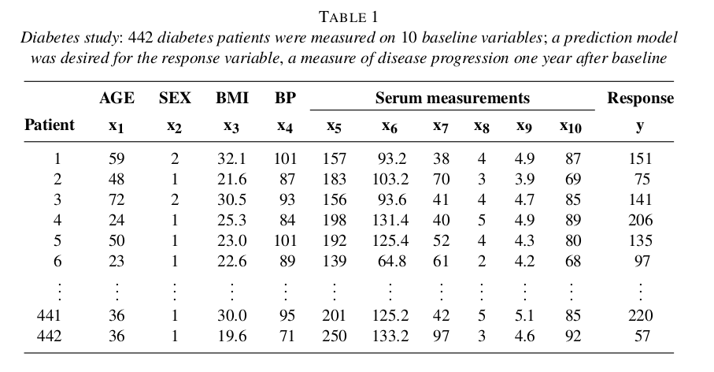

```{r setup, include=FALSE}
fig.dim <- 4
knitr::opts_chunk$set(fig.width=2*fig.dim,
                      fig.height=fig.dim,
                      fig.align='center')
set.seed(23)
library(lars)
library(tidyverse)
library(rstan)
library(matrixStats)
options(mc.cores = parallel::detectCores())
```

# Overview

## Summary

So far we've focused on *discrete* data:
coin flips and counts.

While doing that we came across familiar things,
like Poisson regression.

This week we'll look at *continuous* (i.e., "metric") data.
Different sorts of *predictors* will lead us to different classical statistics:
linear regression, $t$-tests, etcetera.

But, control of the underlying model
will let us easily get more sophisticated,
including for instance
robustness to error, and penalization for overdetermined problems.


# The basic ingredients

*Fact:* standard linear regression
is a maximum likelihood estimate 
for $b_0$ and $b_1$ under the following model:
$$\begin{aligned}
    Y_i &= b_0 + b_1 X_1 + \epsilon_i \\
    \epsilon_i &\sim \Normal(0, \sigma) .
\end{aligned}$$


## Comparison of means

If the predictor, $X$, is *discrete*
then we are doing a $t$-test, or ANOVA, or something.

. . .

Simulate data - difference in means of 3.0:

```{r simdata_t}
truth <- list(b0=1.0, b1=3.0, sigma=0.5)
n <- 200
x <- sample(c(0, +1), size=n, replace=TRUE)
y <- truth$b0 + truth$b1 * x + rnorm(n, mean=0, sd=truth$sigma)
```

------------------

The $t$-test
```{r tt}
system.time( tt <- t.test(y ~ x) )
tt
```

-----------------------------

with Stan
```{r stantt, cache=TRUE}
stt_block <- "
data { 
    int N;
    vector[N] x; // will be a vector of 0's and 1's
    vector[N] y;
}
parameters {
    real b0;
    real b1;
    real<lower=0> sigma;
}
model {
    y ~ normal(b0 + b1*x, sigma);
}"
system.time( stantt <- stan(model_code=stt_block,
                            data=list(N=length(x), x=x, y=y), iter=1e3) )
```

--------------------------

```{r summary_stantt}
rstan::summary(stantt)
```


## Standard linear regression

:::::::::::::: {.columns}
::: {.column width="50%"}


Simulate data

```r
truth <- list(b0=1.0, b1=3.0, sigma=0.5)
n <- 200
x <- rnorm(n, mean=0, sd=3)
y <- ( truth$b0 + truth$b1 * x 
        + rnorm(n, mean=0, sd=truth$sigma) )
```

:::
::: {.column width="50%"}


```{r simdata, fig.width=1.5*fig.dim, fig.height=1.5*fig.dim, echo=FALSE}
truth <- list(b0=1.0, b1=3.0, sigma=0.5)
n <- 200
x <- rnorm(n, mean=0, sd=3)
y <- truth$b0 + truth$b1 * x + rnorm(n, mean=0, sd=truth$sigma)
plot(x,y)
abline(truth$b0, truth$b1, col='red')
```

:::
::::::::::::::


------------------

Standard linear regression
```{r slr}
system.time( slr <- lm(y ~ x) )
summary(slr)
```

-----------------

with Stan
```{r stanlr, cache=TRUE}
slr_block <- "
data {
    int N;
    vector[N] x;
    vector[N] y;
}
parameters {
    real b0;
    real b1;
    real<lower=0> sigma;
}
model {
    y ~ normal(b0 + b1*x, sigma);
}"
system.time( stanlr <- stan(model_code=slr_block,
                            data=list(N=length(x), x=x, y=y), iter=1e3) )
```

----------------


```{r summary_stanlr}
rstan::summary(stanlr)
```


## Multivariate linear regrssion

Simulate data:

```{r simdata_mv}
truth <- list(b0=1.0, 
              b=c(3.0, -1.0, 0.0, 0.0),
              sigma=0.5)
n <- 200
x <- matrix(rnorm(4*n, mean=0, sd=3), ncol=4)
y <- truth$b0 + x %*% truth$b + rnorm(n, mean=0, sd=truth$sigma)
```

. . .

**Your turn:** compare standard multivariate regression
to Stan.

*Note:* `%*%` in R, and `*` in Stan, are *matrix multiplication*.

------------------

Standard linear regression
```{r mlr}
system.time( mlr <- lm(y ~ x) )
summary(mlr)
```

-----------------

with Stan
```{r stanmlr, cache=TRUE}

mlr_block <- "
data {
    int N;
    matrix[N,4] x;
    vector[N] y;
}
parameters {
    real b0;
    vector[4] b1;
    real<lower=0> sigma;
}
model {
    y ~ normal(to_vector(b0 + x * b1), sigma);
    b0 ~ normal(0, 10);
    b1 ~ normal(0, 10);
    sigma ~ normal(0, 10);
}"
system.time( stanmlr <- stan(model_code=mlr_block,
                            data=list(N=nrow(x), x=x, 
                                      y=as.vector(y)), iter=1e3) )

```

----------------


```{r summary_stanmlr}
rstan::summary(stanmlr)
```


# Testing with crossvalidation

## Crossvalidation

Just because a model *fits* doesn't mean that it's any *good*.

. . .

1. Divide your data randomly into 5 pieces.

2. Fit your model on 4/5ths, and see how well it predicts the remaining 1/5th.

3. Do this for each of the 5 pieces.

A better model should have better *crossvalidation accuracy*.

. . .

**Question:** for linear regression,
how do we "see how well it predicts"?
Write down the math, then code it up.


-----------------

```{r do_crossval}
five_groups <- sample(rep(1:5, each=nrow(x)/5))

do_crossval <- function (k) {
    # fit using not group k
    subset_lm <- lm( y ~ x, subset=(five_groups != k))
    # predict on group k
    yhat <- predict(subset_lm, 
                    newdata=list(x=x[five_groups == k,]))
    # compute crossvalidation accuracy
    S <- sqrt( mean( ( y[five_groups == k] - yhat  )^2 ) )
    return(S)
}

crossvals <- sapply(1:5, do_crossval)
```
The mean crossvalidation score for ordinary linear regression
was `r mean(crossvals)`,
with a standard deviation of `r sd(crossvals)`.


## What is overfitting?

Even completely independent sets of numbers
will correlate a little, because of noise.

. . .

When you have a *lot* of variables,
there may be some that correlate well with the response variable just by chance.


. . .

If you have as many variables than observations,
then there is (almost) *always* a linear model that fits *perfectly* (with $\epsilon = 0$).


----------------

*Example:*

```{r overparameterized}
nvars <- 200
truth <- list(b0=1.0, 
              b=rep(0.0, nvars),
              sigma=0.5)
n <- 200
x <- matrix(rnorm(nvars*n, mean=0, sd=3), ncol=nvars)
y <- truth$b0 + x %*% truth$b + rnorm(n, mean=0, sd=truth$sigma)
the_lm <- lm(y ~ x)
range(predict(the_lm) - y)
```


# Stochastic minute

---------------

If $X \sim \Cauchy(\text{center}=\mu, \text{scale}=\sigma)$, then $X$ has probability density
$$\begin{aligned}
    f(x \given \mu, \sigma) = \frac{1}{\pi\left( 1 + \left( \frac{x - \mu}{\sigma} \right)^2 \right)} .
\end{aligned}$$

> 1. The Cauchy is a good example of a distribution with "heavy tails":
>    rare, very large values.
> 
> 2. If $Y$ and $Z$ are independent $\Normal(0,1)$ then $Y/Z \sim \Cauchy(0,1)$.
>
> 3. If $X_1, X_2, \ldots, X_n$ are independent $\Cauchy(0,1)$ then
>    $\max(X_1, \ldots, X_n)$ is of size $n$.
> 
> 4. Also, $\frac{1}{n}(X_1 + \ldots + X_n) \sim \Cauchy(0,1)$.

----------------

4. If $X_1, X_2, \ldots, X_n$ are independent $\Cauchy(0,1)$ then
   $$\begin{aligned}
    \frac{1}{n} \left(X_1 + \cdots + X_n\right) \sim \Cauchy(0,1) .
   \end{aligned}$$

*Wait, what?!?*

. . .

A single value has the *same distribution* as the mean of 1,000 of them?

. . .

Let's look:
```{r cauchy_mean}
meanplot <- function (rf, n=1e3, m=100) {
    x <- matrix(rf(n*m), ncol=m)
    layout(t(1:2))
    hist(x[1,][abs(x[1,])<5], breaks=20, freq=FALSE,
         main=sprintf("%d samples", m),
         xlim=c(-5,5))
    hist(colMeans(x)[abs(colMeans(x))<5], breaks=20, freq=FALSE,
         main=sprintf("%d means of %d each", m, n),
         xlim=c(-5,5))
}
```

----------

$X \sim \Normal(0,1)$
```{r normmeans}
meanplot(rnorm)
```

-----------

$X \sim \Cauchy(0,1)$
```{r cauchymeans}
meanplot(rcauchy)
```

## Another way to look at it: extreme values

```{r max_values}
n <- 100
plot(c(cummax(rcauchy(n))), type='l', ylab='max value so far', xlab='number of samples', col='red')
lines(c(cummax(rnorm(n))), col='black')
legend("bottomright", lty=1, col=c('black', 'red'), legend=c('normal', 'cauchy'))
```

## Another way to look at it: extreme values

```{r max_values2}
n <- 1000
plot(c(cummax(rcauchy(n))), type='l', ylab='max value so far', xlab='number of samples', col='red')
lines(c(cummax(rnorm(n))), col='black')
legend("bottomright", lty=1, col=c('black', 'red'), legend=c('normal', 'cauchy'))
```

## Another way to look at it: extreme values

```{r max_values3}
n <- 1e6
plot(c(cummax(rcauchy(n))), type='l', ylab='max value so far', xlab='number of samples', col='red')
lines(c(cummax(rnorm(n))), col='black')
legend("bottomright", lty=1, col=c('black', 'red'), legend=c('normal', 'cauchy'))
```


# Problem #1: noise

## Cauchy noise

Let's see what happens if 
$$\begin{aligned}
    Y_i &= b_0 + b_1 X_1 + \epsilon_i \\
    \epsilon_i &\sim \Cauchy(0, \sigma) .
\end{aligned}$$

. . .

```{r simdata_c}
truth <- list(b0=1.0, b1=3.0, sigma=0.5)
n <- 1000
x <- sample(c(0, +1), size=n, replace=TRUE)
y <- truth$b0 + truth$b1 * x + rcauchy(n, location=0, scale=truth$sigma)
```

------------------

The $t$-test
```{r ct}
system.time( tt <- t.test(y ~ x) )
tt
```

-----------------------------

with Stan
```{r stantct, cache=TRUE}
sct_block <- "
data { 
    int N;
    vector[N] x; // will be a vector of 0's and 1's
    vector[N] y;
}
parameters {
    real b0;
    real b1;
    real<lower=0> sigma;
}
model { 
    y ~ cauchy(b0 + b1*x, sigma);
}"
system.time( stanct <- stan(model_code=sct_block,
                            data=list(N=length(x), x=x, y=y), iter=1e3) )
```

--------------------------

```{r summary_stanct}
rstan::summary(stanct)
```

-----------

Because we *correctly model* the noise,
using Stan,
we are not thrown off by large values.


# Today's goals

## Today's goals

1. Formulate and carry out robust Bayesian ANOVA

2. Use crossvalidation to compare robust regression to ordinary regression


# Robust ANOVA

## Metric data from groups

Suppose we have numerical observations coming from $m$ different groups,
and want to know if the *means* are different between groups, and by how much.

. . .

:::::::::::::: {.columns}
::: {.column width="50%"}

e.g., dry leaf mass after 10d of growth
in 6 different conditions


:::
::: {.column width="50%"}


```{r simdata_ra, fig.width=1.5*fig.dim, fig.height=1.5*fig.dim, echo=FALSE}
m <- 20
truth <- list(b=200 + rnorm(m, sd=5), sigma=2.0)
n <- 200
x <- sample(1:m, size=n, replace=TRUE)
y <- pmax(0, truth$b[x]
              + rcauchy(n, location=0, 
                      scale=truth$sigma) )
```


:::
::::::::::::::


-----------------


:::::::::::::: {.columns}
::: {.column width="50%"}

dry leaf mass after 10d of growth
in 6 different conditions

```r
boxplot(y ~ x, main='all data')
points(seq_along(truth$b), truth$b, pch=20, cex=2.0, col='red')
boxplot(y ~ x, subset=abs(y-200)<20, xlab='treatment', main='abs(y-200) < 10')
points(seq_along(truth$b), truth$b, pch=20, cex=2.0, col='red')
```


:::
::: {.column width="50%"}

```{r plotdata_ra, fig.width=1.5*fig.dim, fig.height=2*fig.dim, echo=FALSE}
layout(1:2)
boxplot(y ~ x, main='all data')
points(seq_along(truth$b), truth$b, pch=20, cex=2.0, col='red')
boxplot(y ~ x, subset=abs(y-200)<20, xlab='treatment', main='abs(y-200) < 10')
points(seq_along(truth$b), truth$b, pch=20, cex=2.0, col='red')
```

:::
::::::::::::::


-------------------


:::::::::::::: {.columns}
::: {.column width="50%"}


```r
data {
}
parameters {
}
model {
}
```

:::
::: {.column width="50%"}

```{r plotdata_ra2, fig.width=1.5*fig.dim, fig.height=2*fig.dim, echo=FALSE}
layout(1:2)
boxplot(y ~ x, main='all data')
points(seq_along(truth$b), truth$b, pch=20, cex=2.0, col='red')
boxplot(y ~ x, subset=abs(y-200)<20, xlab='treatment', main='abs(y-200) < 10')
points(seq_along(truth$b), truth$b, pch=20, cex=2.0, col='red')
```

:::
::::::::::::::

--------------

:::::::::::::: {.columns}
::: {.column width="50%"}


*What do we want to know?*

1. Do the treatments affect mean growth?

2. How much does leaf mass in treatment 8 differ from group 12?

3. How much variation is explained by treatment?

:::
::: {.column width="50%"}


*How do we find it out?*

:::
::::::::::::::


## Do treatments affect growth?


## How much do treatments 8 and 12 differ?


## How much variation is explained by treatment?


# Robust regression

## Some data

:::::::::::::: {.columns}
::: {.column width="50%"}


Relative axon growth
for neurons after $x$ hours:

```r
truth <- list(b0=1.0, b1=3.0, sigma=0.5)
n <- 200
x <- rnorm(n, mean=0, sd=3)
y <- ( truth$b0 + truth$b1 * x 
        + rcauchy(n, location=0, 
                  scale=truth$sigma) )
```

:::
::: {.column width="50%"}

```{r simdata_rr, fig.width=1.5*fig.dim, fig.height=1.5*fig.dim, echo=FALSE}
truth <- list(b0=1.0, b1=3.0, sigma=0.5)
n <- 200
x <- rnorm(n, mean=0, sd=3)
y <- truth$b0 + truth$b1 * x + rcauchy(n, location=0, scale=truth$sigma)
plot(x,y)
abline(truth$b0, truth$b1, col='red')
```

:::
::::::::::::::


------------------

Standard linear regression
```{r slrr}
system.time( slr2 <- lm(y ~ x) )
summary(slr2)
```

-----------------

with Stan
```{r stanrr, cache=TRUE}
srr_block <- "
data { 
    int N;
    vector[N] x;
    vector[N] y;
}
parameters {
    real b0;
    real b1;
    real<lower=0> sigma;
}
model {
    y ~ cauchy(b0 + b1*x, sigma);
}"
system.time( stanrr <- stan(model_code=srr_block,
                            data=list(N=length(x), x=x, y=y), iter=1e3) )
```

----------------


```{r summary_stanrr}
rstan::summary(stanrr)
```

## Compare the results.

Make a table and/or a graph of estimates and confidence intervals
obtained by (a) ordinary linear regression
and (b) robust regression as we have done here.


## Crossvalidation plan

1. Put aside 20% of the data for *testing*.

2. Refit the model.

3. Predict the test data; compute
   $$\begin{aligned}
    S = \sqrt{\frac{1}{M} \sum_{k=1}^M (\hat y_i - y_i)^2}
   \end{aligned}$$

4. Repeat for the other four 20%s.

5. Compare.


## For ordinary linear regression

```{r do_crossval_again}
five_groups <- sample(rep(1:5, each=NROW(x)/5))

do_crossval <- function (k) {
    # fit using not group k
    subset_lm <- lm( y ~ x, subset=(five_groups != k))
    # predict on group k
    yhat <- predict(subset_lm, 
                    newdata=list(x=x[five_groups == k]))
    # compute crossvalidation accuracy
    S <- sqrt( mean( ( y[five_groups == k] - yhat  )^2 ) )
    return(S)
}

crossvals <- sapply(1:5, do_crossval)
```
The mean crossvalidation score for ordinary linear regression
was `r mean(crossvals)`;
the five values were `r crossvals`.


## For Stan

```{r five_stans, cache=TRUE}
five_stans <- lapply(1:5, function (k) {
                         use_these <- (five_groups != k)
                         stan(model_code=srr_block,
                              data=list(N=sum(use_these),
                                        x=x[use_these],
                                        y=y[use_these]),
                              iter=1e3) } )
```

## Your turn


# Problem #2: too many variables


## Example data



-----------

```{r lars_data}
library(lars)
data(diabetes)
class(diabetes$x2) <- "matrix"
```
```
diabetes                 package:lars                  R Documentation

Blood and other measurements in diabetics

Description:

     The ‘diabetes’ data frame has 442 rows and 3 columns. These are
     the data used in the Efron et al "Least Angle Regression" paper.

Format:

     This data frame contains the following columns:

     x a matrix with 10 columns

     y a numeric vector

     x2 a matrix with 64 columns
```

---------------

The dataset has

- 442 diabetes patients
- 10 main variables: age, gender, body mass index, average blood pressure (map), 
  and six blood serum measurements (tc, ldl, hdl, tch, ltg, glu)
- 45 interactions, e.g. `age:ldl`
- 9 quadratic effects, e.g. `age^2`
- measure of disease progression taken one year later, `y`

## Crossvalidation

First let's split the data into testing and training just once:
```{r split_data}
test_indices <- (rbinom(length(diabetes$y), size=1, prob=0.2) == 1)
test_d <- cbind(data.frame(y=diabetes$y[test_indices]),
                diabetes$x2[test_indices,])
training_d <- cbind(data.frame(y=diabetes$y[!test_indices]),
                diabetes$x2[!test_indices,])
```

## Ordinary linear regression

```{r ols}
ols <- lm(y ~ ., data=training_d)
summary(ols)
```

-------------

```{r crossval_ols}
ols_pred <- predict(ols, newdata=test_d)
ols_mse <- sqrt(mean((ols_pred - test_d$y)^2))
```
With ordinary linear regression, we got a root-mean-square-error of `r ols_mse`.

------------

```{r plot_ols}
plot(test_d$y, ols_pred, xlab="true values", ylab="OLS predicted")
abline(0,1)
```


## A sparsifying prior

We have a lot of predictors: 64 of them.
A good guess is that only a few are really useful.
So, we can put a *sparsifying* prior on the coefficients,
i.e., the $\beta$s in
$$\begin{aligned}
    y = \beta_0 + \beta_1 x_1 + \cdots \beta_n x_n + \epsilon
\end{aligned}$$

